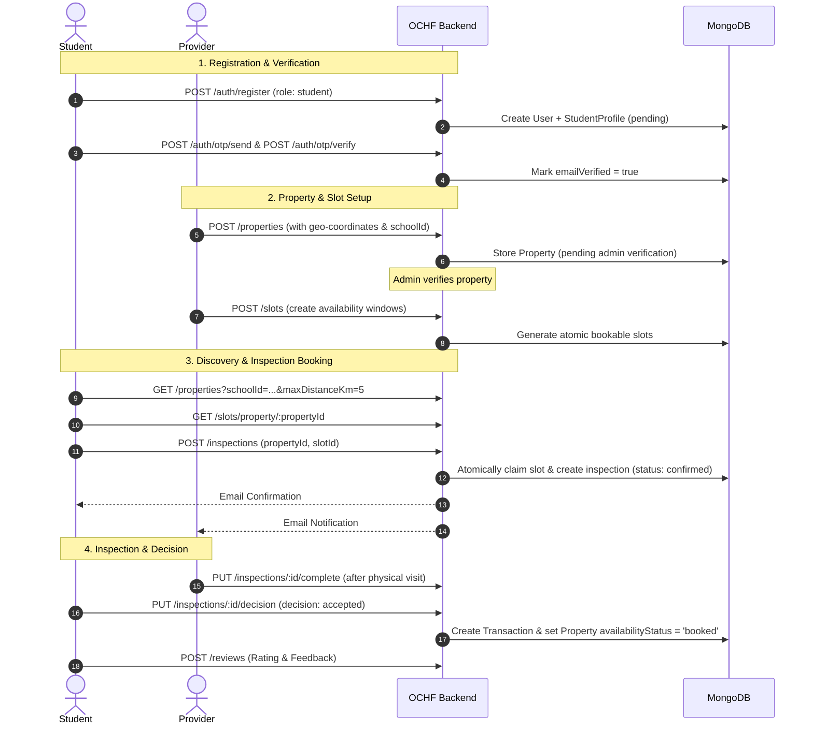

# Off-Campus Hostel Finder (OCHF) — Backend API

[](https://nodejs.org/)
[](https://expressjs.com/)
[](https://www.mongodb.com/)
[](https://jwt.io/)
[](https://opensource.org/licenses/ISC)

> **Group 16 Backend Capstone Project**  
> A secure, scalable RESTful API service powering an off-campus accommodation platform. OCHF bridges tertiary institution students and verified property providers (landlords/agents) with integrated distance calculation from school campuses, atomic inspection slot booking, secure transaction management, and administrative moderation.

---

## Table of Contents

- [Overview](#overview)
- [Key Features](#key-features)
- [System Architecture & Lifecycle](#system-architecture--lifecycle)
- [Technology Stack](#technology-stack)
- [Project Directory Structure](#project-directory-structure)
- [Database Models & Schemas](#database-models--schemas)
- [Environment Variables](#environment-variables)
- [Getting Started](#getting-started)
  - [Prerequisites](#prerequisites)
  - [Installation](#installation)
  - [Running the Application](#running-the-application)
- [API Reference](#api-reference)
  - [Authentication & OTP (`/auth`)](#1-authentication--verification-auth)
  - [Properties & Geospatial Search (`/properties`)](#2-properties-properties)
  - [Inspection Slots (`/slots`)](#3-inspection-slots-slots)
  - [Inspections & Bookings (`/inspections`)](#4-inspections-inspections)
  - [Transactions (`/transactions`)](#5-transactions-transactions)
  - [Reviews & Ratings (`/reviews`)](#6-reviews-reviews)
  - [Reports & Flags (`/reports`)](#7-reports-reports)
  - [Admin Moderation (`/admin`)](#8-admin-management-admin)
  - [Notifications & Diagnostics (`/notifications`)](#9-notifications--mailer-notifications)
- [Automated Background Jobs](#automated-background-jobs)
- [Security & Data Privacy](#security--data-privacy)
- [License](#license)

---

## Overview

Finding safe, affordable, and proximate accommodation off-campus is one of the biggest friction points for tertiary students. **Off-Campus Hostel Finder (OCHF)** solves this by providing:

1. **Anti-Fraud & Trust**: Verified listings and verified student profiles.
2. **Proximity Intelligence**: Geospatial distance calculation (Haversine formula) and estimated driving times between hostels and specific university/polytechnic campuses.
3. **Atomic Slot Scheduling**: Elimination of double-bookings through atomic inspection reservations and provider-defined availability windows.
4. **End-to-End Inspection Pipeline**: Complete booking lifecycle from booking to attendance, decision (accept/reject), and transaction creation.
5. **Verified Reviews**: Strict review authorization—only students who attended and accepted an inspection can leave a rating.

---

## Key Features

- **Role-Based Access Control (RBAC)**: Distinct permissions for `student`, `provider`, and `admin` roles with robust JWT authentication.
- **Student Email OTP Verification**: Time-based (10-minute TTL) one-time passcode with resend cooldowns (60s) and hourly limits (max 5/hour).
- **Geospatial Proximity Queries**: MongoDB `2dsphere` indexes supporting `$near` and `$geoWithin` queries for campus-centric property discovery.
- **Provider Contact Shielding**: Landlord contact phone numbers are protected and never disclosed directly to unverified guests or students, avoiding off-platform scams.
- **Self-Service Inspection Slots**: Providers set availability windows; the API divides them into fixed bookable intervals (15–120 mins).
- **Inspection Decision & Auto-Transaction**: When a student accepts a property post-inspection, a transaction is automatically spun up and the property is taken off the market.
- **Automated Background Reminders**: Scheduled runner that periodically alerts both student and provider ahead of upcoming inspections.
- **Dispute & Report Center**: Any authenticated user can submit reports on properties or transactions for admin triage.

---

## System Architecture & Lifecycle

### Inspection & Booking Flow



---

## Technology Stack

| Component | Technology / Library | Description |
| :--- | :--- | :--- |
| **Runtime Environment** | Node.js (CommonJS) | Server runtime (v18+) |
| **Web Framework** | Express.js (v5) | Routing, middleware, RESTful API controllers |
| **Database & ODM** | MongoDB Atlas, Mongoose (v9) | Schema definitions, validation, GeoJSON indexing |
| **Authentication** | JSON Web Tokens (`jsonwebtoken`), `bcrypt` | Stateless bearer token auth and password hashing |
| **Security & OTP** | Node `crypto` (HMAC SHA-256) | Hashed OTP code storage and verification |
| **Email & Dispatch** | Nodemailer | SMTP client with automated console logging for dev |
| **File Handling** | Multer, Cloudinary | Multi-part form data processing and media storage |
| **Configuration** | `dotenv` | Environment variable management |

---

## Project Directory Structure

```plaintext
Group16-BE-Capstone-Project-OCHF/
├── controller/                   # Request handlers and business logic
│   ├── adminController.js        # Admin moderation, approvals & user status
│   ├── authController.js         # User registration, login, token issuance
│   ├── inspectionController.js   # Inspection booking, status updates & decisions
│   ├── otpController.js          # Student email verification OTP workflows
│   ├── propertyController.js     # Property CRUD, geospatial queries & metrics
│   ├── reportController.js       # User reporting & violation logging
│   ├── reviewController.js       # Property rating and feedback management
│   ├── slotController.js         # Time slot generation and availability management
│   └── transactionController.js  # Booking transactions and payment tracking
├── middleware/                   # Express custom middleware
│   └── auth.js                   # protect, authorize, requireVerifiedStudent, optionalProtect
├── model/                        # Database schemas & ODM definitions
│   └── collectionsModel.js       # Mongoose schemas: User, Property, Inspection, etc.
├── routes/                       # Express route declarations
│   ├── adminRoutes.js            # /admin
│   ├── authRoutes.js             # /auth
│   ├── inspectionRoutes.js       # /inspections
│   ├── mailerRoutes.js           # /notifications
│   ├── propertyRoutes.js         # /properties
│   ├── reportRoutes.js           # /reports
│   ├── reviewRoutes.js           # /reviews
│   ├── slotRoutes.js             # /slots
│   └── transactionRoutes.js      # /transactions
├── utils/                        # Shared utility modules
│   ├── mailer.js                 # Nodemailer transport & dev mock logger
│   ├── notify.js                 # Notification email templates and dispatch
│   ├── reminders.js              # Background scheduler for inspection reminders
│   └── token.js                  # JWT token generator helper
├── .env.example                  # Sample environment variables template
├── .gitignore                    # Git ignore file
├── package.json                  # Project metadata and dependencies
├── package-lock.json             # Locked dependency versions
├── README.md                     # Project documentation
└── server.js                     # Main application entry point & DB connection
```

---

## Database Models & Schemas

The application defines 12 interconnected collections in `model/collectionsModel.js`:

1. **`User`**: Core credentials (`email`, `passwordHash`, `role: ['student', 'provider', 'admin']`, `isActive`, `emailVerified`).
2. **`StudentProfile`**: Full name, telephone, linked school, student verification document and status (`pending`, `verified`, `rejected`).
3. **`ProviderProfile`**: Business name, verified phone number, landlord accreditation documents and verification status.
4. **`School`**: Tertiary institutions with GeoJSON `Point` coordinates (`[longitude, latitude]`) with `2dsphere` index.
5. **`Property`**: Hostels/apartments containing embedded charges (`additionalCharges`), photos (`photos`), amenities, GeoJSON coordinates, price, linked school, distance/driving time, availability (`available`, `unavailable`, `booked`), and verification status.
6. **`Slot`**: Bookable inspection time slots with `startsAt`, `endsAt`, and status (`open`, `booked`).
7. **`Inspection`**: Inspection requests linked to property, student, slot, status (`requested`, `confirmed`, `rescheduled`, `completed`, `cancelled`, `missed`), and final decision (`pending`, `accepted`, `rejected`).
8. **`Transaction`**: Records created upon student acceptance, tracking payment total and progression (`pending`, `in_progress`, `completed`, `cancelled`).
9. **`Review`**: Student ratings (1–5) and comments. Unique constraint ensures one review per student per property.
10. **`Report`**: Abuse/fraud reports filed against properties or transactions (`open`, `reviewed`, `resolved`).
11. **`Otp`**: One-time passcodes stored as HMAC hashes with auto-expiring TTL indexes.
12. **`Notification`**: In-app notifications mirroring email dispatches with deduplication keys.

---

## Environment Variables

Copy `.env.example` to `.env` in the root directory:

```bash
cp .env.example .env
```

Configure the following variables:

| Variable | Required | Default | Description |
| :--- | :--- | :--- | :--- |
| `PORT` | No | `5000` | Port for the HTTP server |
| `NODE_ENV` | No | `development` | Runtime environment (`development`, `production`) |
| `MONGOATLAS_URI` | **Yes** | — | MongoDB Atlas connection string |
| `JWT_SECRET` | **Yes** | — | Secret key used for signing JWTs and OTP hashes |
| `JWT_EXPIRES_IN` | No | `7d` | Token validity duration (e.g., `24h`, `7d`) |
| `OTP_AUTO_VERIFY` | No | `true` | When true, verifying email marks pending student as verified |
| `REMINDER_HOURS` | No | `24` | Lookahead window (in hours) for inspection reminders |
| `REMINDER_CHECK_MINUTES` | No | `10` | Frequency (in minutes) for inspection reminder checks |
| `APP_TIMEZONE` | No | `Africa/Lagos` | Timezone string for email timestamps |
| `SMTP_HOST` | No | *Empty* | SMTP server host (e.g. `smtp.gmail.com`). If empty in dev, emails print to console. |
| `SMTP_PORT` | No | `587` | SMTP port (`587` for TLS, `465` for SSL) |
| `SMTP_USER` | No | *Empty* | SMTP username / sender email |
| `SMTP_PASS` | No | *Empty* | SMTP password or App Password |
| `MAIL_FROM` | No | `SMTP_USER` | Display name and email address for outbound emails |
| `CLOUDINARY_CLOUD_NAME` | No | *Empty* | Cloudinary cloud identifier for image uploads |
| `CLOUDINARY_API_KEY` | No | *Empty* | Cloudinary public API key |
| `CLOUDINARY_API_SECRET` | No | *Empty* | Cloudinary secret API key |

---

## Getting Started

### Prerequisites

- [Node.js](https://nodejs.org/) (version 18.x or later)
- [npm](https://www.npmjs.com/) (version 9.x or later)
- A running [MongoDB Atlas](https://www.mongodb.com/atlas) cluster or local MongoDB instance

### Installation

1. Clone the repository:
   ```bash
   git clone https://github.com/emmybackenddev08/Group16-BE-Capstone-Project-OCHF.git
   cd Group16-BE-Capstone-Project-OCHF
   ```

2. Install dependencies:
   ```bash
   npm install
   ```

3. Setup environment configuration:
   ```bash
   cp .env.example .env
   # Edit .env with your MongoDB Atlas URI and JWT_SECRET
   ```

4. Seed the default administrator account & tertiary campuses:
   ```bash
   npm run seed:admin
   npm run seed:schools
   ```
   *Creates the default admin user (`admin@ochf.com` / `AdminPassword123!`) and populates initial tertiary institutions (UNILAG, YABATECH, LASU, UI, OAU, FUTA) with GeoJSON coordinates for distance calculations.*

### Running the Application

- **Production / Standard Mode**:
  ```bash
  npm start
  ```

Once connected to MongoDB, the server will output:
```plaintext
MongoDB connected
Reminder job started (every 10 min, window 24h)
Server running on port 5000
```

---

## API Reference

All requests and responses use JSON. For protected routes, provide the JWT in the HTTP Authorization header:
```
Authorization: Bearer <your_jwt_token>
```

> [!TIP]
> **Postman Collection Available**: A pre-configured Postman collection with all 55 endpoints, sample payloads, and auto-token test scripts is provided in the repository root: [`OCHF_API.postman_collection.json`](./OCHF_API.postman_collection.json). Simply import this file into Postman to start testing immediately!


### 1. Authentication & Verification (`/auth`)

| Method | Endpoint | Access | Description |
| :--- | :--- | :--- | :--- |
| `POST` | `/auth/register` | Public | Register as `student` or `provider` |
| `POST` | `/auth/login` | Public | Authenticate user & retrieve JWT token |
| `GET` | `/auth/me` | Authenticated | Retrieve authenticated user profile |
| `POST` | `/auth/otp/send` | Student | Request email verification OTP |
| `POST` | `/auth/otp/resend` | Student | Resend OTP code (subject to 60s cooldown) |
| `POST` | `/auth/otp/verify` | Student | Verify 6-digit OTP code |

<details>
<summary><strong>View Auth Request/Response Examples</strong></summary>

#### Register (`POST /auth/register`)
```json
{
  "email": "student@university.edu.ng",
  "password": "Password123!",
  "confirmPassword": "Password123!",
  "role": "student",
  "fullName": "Jane Doe",
  "phone": "+2348012345678",
  "schoolId": "651f8a84c2f42a1234567890"
}
```

#### Login (`POST /auth/login`)
```json
{
  "email": "student@university.edu.ng",
  "password": "Password123!"
}
```
</details>

---

### 2. Properties (`/properties`)

| Method | Endpoint | Access | Description |
| :--- | :--- | :--- | :--- |
| `GET` | `/properties` | Public | Search/filter verified properties with pagination |
| `GET` | `/properties/:id` | Public (Optional Auth) | Fetch property details (contact info shielded) |
| `GET` | `/properties/mine` | Provider | Fetch provider's own listings (all statuses) |
| `POST` | `/properties` | Provider | Create a new property listing |
| `PUT` | `/properties/:id` | Provider (Owner) | Update an existing listing |
| `DELETE` | `/properties/:id` | Provider (Owner) | Delete a listing |

#### Search & Query Parameters (`GET /properties`)
- `schoolId`: ObjectId of university to measure distance from
- `maxDistanceKm`: Radius in kilometers (default: 10km)
- `minPrice` / `maxPrice`: Numerical price range filters
- `amenities`: Comma-separated list (e.g., `wifi,water,generator`)
- `propertyType`: `room`, `self_contain`, `shared`, `apartment`, `hostel`
- `q`: Keyword search against title, description, and address
- `sort`: `price_asc`, `price_desc`, `newest`
- `page` & `limit`: Pagination controls (max limit: 50)

---

### 3. Inspection Slots (`/slots`)

| Method | Endpoint | Access | Description |
| :--- | :--- | :--- | :--- |
| `POST` | `/slots` | Provider | Generate time slots from availability windows |
| `GET` | `/slots/mine` | Provider | Retrieve all slots created by provider |
| `GET` | `/slots/property/:propertyId` | Verified Student | View open upcoming slots for a property |
| `DELETE` | `/slots/:id` | Provider (Owner) | Delete/cancel an open slot |

<details>
<summary><strong>View Slot Generation Payload</strong></summary>

```json
{
  "propertyId": "651f8a84c2f42a1234567891",
  "slotMinutes": 30,
  "windows": [
    {
      "start": "2026-10-10T10:00:00+01:00",
      "end": "2026-10-10T14:00:00+01:00"
    }
  ]
}
```
</details>

---

### 4. Inspections (`/inspections`)

| Method | Endpoint | Access | Description |
| :--- | :--- | :--- | :--- |
| `POST` | `/inspections` | Verified Student | Atomically book an open slot |
| `GET` | `/inspections/mine` | Student | List all inspections booked by student |
| `GET` | `/inspections/received` | Provider | List all inspection requests received |
| `GET` | `/inspections/:id` | Participant | Inspection details |
| `PUT` | `/inspections/:id/schedule` | Provider | Confirm and schedule inspection |
| `PUT` | `/inspections/:id/decline` | Provider | Decline inspection request |
| `PUT` | `/inspections/:id/reschedule` | Provider | Assign booking to a new open slot |
| `PUT` | `/inspections/:id/complete` | Provider | Mark physical inspection as completed |
| `PUT` | `/inspections/:id/missed` | Provider | Mark inspection as missed/no-show |
| `PUT` | `/inspections/:id/decision` | Student | Accept or reject property post-inspection |
| `DELETE` | `/inspections/:id` | Student | Cancel booking (frees slot back to open) |

---

### 5. Transactions (`/transactions`)

| Method | Endpoint | Access | Description |
| :--- | :--- | :--- | :--- |
| `GET` | `/transactions/mine` | Student | View transactions created from accepted bookings |
| `GET` | `/transactions/received` | Provider | View received transactions for owned properties |
| `GET` | `/transactions/:id` | Participant | View transaction details and payment breakdown |
| `PUT` | `/transactions/:id/status` | Participant | Advance transaction status (`pending` -> `in_progress` -> `completed` / `cancelled`) |

---

### 6. Reviews (`/reviews`)

| Method | Endpoint | Access | Description |
| :--- | :--- | :--- | :--- |
| `POST` | `/reviews` | Verified Student | Create property review (only if accepted inspection exists) |
| `GET` | `/reviews/property/:propertyId` | Public | Get all reviews and computed average rating |
| `GET` | `/reviews/mine` | Student | List all reviews submitted by the student |
| `PUT` | `/reviews/:id` | Student (Author) | Update rating or comment |
| `DELETE` | `/reviews/:id` | Student (Author) | Remove a review |

---

### 7. Reports (`/reports`)

| Method | Endpoint | Access | Description |
| :--- | :--- | :--- | :--- |
| `POST` | `/reports` | Authenticated | Report a listing or transaction for violation |
| `GET` | `/reports/mine` | Authenticated | View reports filed by the current user |

---

### 8. Admin Management (`/admin`)

*All `/admin` endpoints require an authenticated user with `role: admin`.*

| Method | Endpoint | Description |
| :--- | :--- | :--- |
| `GET` | `/admin/users` | List all users with query filters (`role`, `status`, `q`) |
| `PUT` | `/admin/users/:id/status` | Suspend or reactivate user account (`active`, `suspended`) |
| `GET` | `/admin/students` | Review student verification applications (`?status=pending`) |
| `PUT` | `/admin/students/:id` | Approve (`verified`) or decline (`rejected`) student profile |
| `GET` | `/admin/providers` | Review provider verification documents |
| `PUT` | `/admin/providers/:id` | Approve (`verified`) or decline (`rejected`) provider profile |
| `GET` | `/admin/properties` | Queue of pending property listings |
| `PUT` | `/admin/properties/:id` | Approve (`verified`) or reject (`rejected`) property listing |
| `GET` | `/admin/inspections` | System-wide view of all inspection bookings |
| `GET` | `/admin/reports` | Triaging moderation reports (`open`, `reviewed`, `resolved`) |
| `PUT` | `/admin/reports/:id` | Update report status |

---

### 9. Notifications & Mailer (`/notifications`)

| Method | Endpoint | Access | Description |
| :--- | :--- | :--- | :--- |
| `POST` | `/notifications/test` | Admin | Validate SMTP outbound configuration |
| `POST` | `/notifications/announce` | Admin | Dispatch targeted system announcement |

---

### 10. Schools & Campuses (`/schools`)

| Method | Endpoint | Access | Description |
| :--- | :--- | :--- | :--- |
| `GET` | `/schools` | Public | List all registered tertiary campuses (supports `?q=` search) |
| `GET` | `/schools/:id` | Public | Get single campus details and GeoJSON coordinates |
| `POST` | `/schools` | Admin | Register a new school/campus with coordinates |

---

## Automated Background Jobs

The server boots a continuous background reminder worker via `utils/reminders.js`:

- **Execution Frequency**: Configured via `REMINDER_CHECK_MINUTES` (default: every 10 minutes).
- **Inspection Scan**: Finds inspections with status `confirmed` or `rescheduled` starting within `REMINDER_HOURS` (default: next 24 hours).
- **Concurrency Safety**: Employs atomic `findOneAndUpdate` queries on `reminderSentAt: null` to avoid duplicate dispatches across clustered instances.
- **Fail-Safe Mechanism**: If mail dispatch fails, the claim is automatically rolled back for immediate retry on the next interval.

---

## Security & Data Privacy

- **Data Shielding (Anti-Poaching & Safety)**: Landlord phone numbers and business identities are shielded from guests and unverified users, reducing scam risks.
- **Password Protection**: Passwords are salted and hashed with `bcrypt` (10 rounds).
- **OTP Tamper Prevention**: OTP codes are hashed via HMAC SHA-256 before storage; raw codes are never saved to the database.
- **Anti-Race Condition**: Atomic slot claiming ensures that when two users attempt to book the same slot at the exact same millisecond, only one succeeds.
- **Input Sanitization**: Regular expressions in search queries are systematically escaped against ReDoS and injection vulnerabilities.

---

## License

This project is licensed under the **ISC License**. See the `package.json` file for details.
